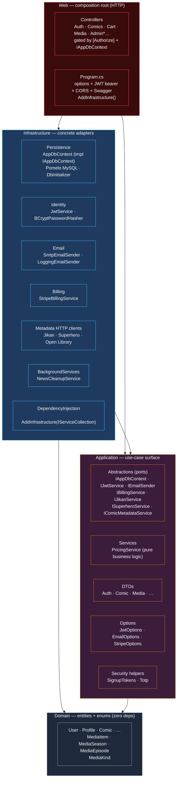
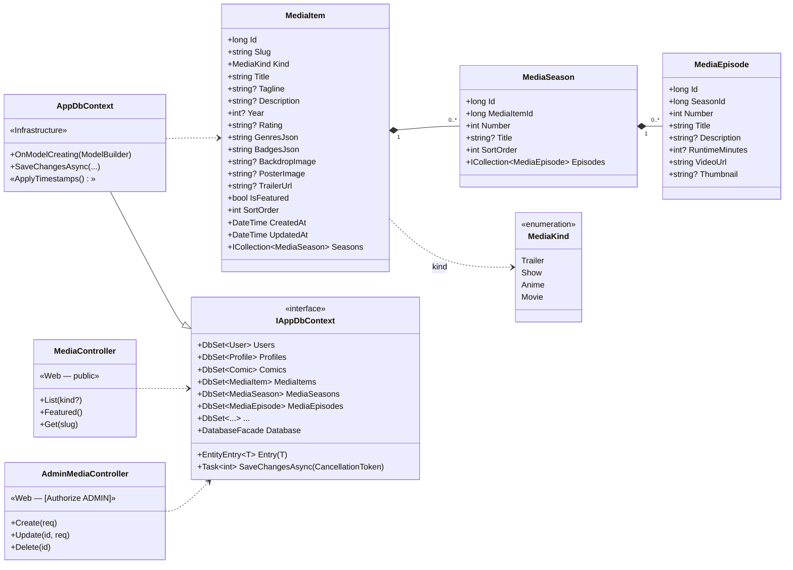

# Bazinga — Architecture & Data Diagrams

All diagrams below are written in Mermaid; GitHub renders them inline (and
they stay in sync with the code because they live in the repo). Open this
file on GitHub for the rendered versions, or paste any block into
<https://mermaid.live> for an exportable SVG/PNG.

---

## 1. Clean Architecture — projects & dependency direction

The backend split into four .NET projects with strictly inward dependencies.
Domain is the innermost ring; Web is the only HTTP-aware project.



**Reading it.** Every arrow points to a project the caller depends on; no
arrow ever points outward, which is the Clean Architecture invariant. The Web
layer talks to persistence through the Application-owned `IAppDbContext`
interface, not the concrete `AppDbContext` — that's the seam that lets us
swap the implementation in tests without touching controllers.

---

## 2. Database — entity-relationship diagram

Tables created and forward-patched on startup by `DbInitializer`. The recently
added media tables (`media_items` / `media_seasons` / `media_episodes`) are
the source of truth for everything the TV surfaces play; videos are external
URLs (S3, CloudFront, YouTube embed…), nothing ships in `public/`.

```mermaid
erDiagram
    users ||--o{ profiles                : owns
    users ||--o{ carts                   : has
    users ||--o{ wishlists               : has
    users ||--o{ libraries               : has
    users ||--o{ orders                  : places
    users ||--o{ reviews                 : writes
    users ||--o{ reports                 : files
    users ||--o{ news_posts              : authors
    users ||--o{ signup_tokens           : "by email"
    users ||--o{ signin_tokens           : "by email"
    users ||--o{ password_reset_tokens   : "by email"
    users ||--o{ two_factor_challenges   : challenges

    profiles ||--o{ profile_collection_items : "library + my-list"

    categories ||--o{ comics : classifies
    conditions ||--o{ comics : grades
    comics    ||--o{ cart_items     : "in cart"
    comics    ||--o{ wishlist_items : "in wishlist"
    comics    ||--o{ library_items  : "in library"
    comics    ||--o{ reviews        : reviewed
    comics    ||--o{ reports        : reported

    carts     ||--o{ cart_items     : contains
    wishlists ||--o{ wishlist_items : contains
    libraries ||--o{ library_items  : contains
    report_categories ||--o{ reports : "kind of"

    media_items   ||--o{ media_seasons  : has
    media_seasons ||--o{ media_episodes : has

    users {
      bigint id PK
      varchar username UK
      varchar email UK
      varchar password
      varchar first_name
      varchar last_name
      date    date_of_birth
      varchar phone
      varchar role "USER | ADMIN | EDITOR"
      varchar subscription_type "Free | Comics | TV | Unlimited | Premium"
      date    subscription_expiration
      tinyint two_factor_enabled
      varchar two_factor_secret
      datetime created_at
      datetime updated_at
    }
    profiles {
      bigint id PK
      bigint user_id FK
      varchar name
      varchar avatar_url
      varchar avatar_color
      varchar avatar_icon
      tinyint is_root
      tinyint is_kids
      varchar pin_hash
      datetime created_at
      datetime updated_at
    }
    comics {
      bigint id PK
      varchar title
      varchar author
      varchar isbn UK
      text    description
      varchar main_character
      varchar series
      int     published_year
      bigint  condition_id FK
      bigint  category_id  FK
      decimal price
      varchar image
      varchar comic_type "PHYSICAL_COPY | ONLY_DIGITAL"
      tinyint redacted
      datetime created_at
      datetime updated_at
    }
    media_items {
      bigint id PK
      varchar slug UK
      varchar kind "trailer | show | anime | movie"
      varchar title
      varchar tagline
      text    description
      int     year
      varchar rating
      text    genres_json
      text    badges_json
      varchar backdrop_image
      varchar poster_image
      varchar trailer_url
      tinyint is_featured
      int     sort_order
      datetime created_at
      datetime updated_at
    }
    media_seasons {
      bigint id PK
      bigint media_item_id FK
      int    number
      varchar title
      int    sort_order
    }
    media_episodes {
      bigint id PK
      bigint season_id FK
      int    number
      varchar title
      text    description
      int     runtime_minutes
      varchar video_url "external S3 / CloudFront / embed"
      varchar thumbnail
    }
    profile_collection_items {
      bigint  id PK
      bigint  profile_id FK
      varchar collection "library | mylist"
      varchar kind "comic | manga | anime | show"
      varchar content_id "opaque (provider id or media slug)"
      varchar title
      varchar image
      varchar subtitle
      longtext payload_json
      datetime added_at
    }
    cart_items   { bigint id PK; bigint cart_id FK; bigint comic_id FK; int quantity; varchar purchase_type; decimal unit_price }
    carts        { bigint id PK; bigint user_id FK; datetime created_at; datetime updated_at }
    wishlists    { bigint id PK; bigint user_id FK; datetime created_at }
    wishlist_items { bigint id PK; bigint wishlist_id FK; bigint comic_id FK; datetime added_at }
    libraries    { bigint id PK; bigint user_id FK; datetime created_at }
    library_items { bigint id PK; bigint library_id FK; bigint comic_id FK; datetime added_at }
    categories   { bigint id PK; varchar name UK; varchar description }
    conditions   { bigint id PK; varchar condition_description UK }
    orders       { bigint id PK; bigint user_id FK; decimal total_amount; varchar status; varchar shipping_address; varchar billing_address; datetime order_date }
    reviews      { bigint id PK; bigint user_id FK; bigint comic_id FK; int rating; text comment; datetime review_date }
    reports      { bigint id PK; text report_text; datetime report_date; bigint user_id FK; bigint comic_id FK; bigint report_category_id FK }
    report_categories { bigint id PK; varchar category_name UK; varchar description }
    news_posts   { bigint id PK; varchar title; text content; bigint author_id FK; datetime created_at; datetime expires_at }
    signup_tokens { bigint id PK; varchar email; varchar token_hash UK; datetime expires_at; datetime created_at; datetime consumed_at; tinyint opt_out_marketing }
    signin_tokens { bigint id PK; varchar email; varchar token_hash UK; datetime expires_at; datetime created_at; datetime consumed_at }
    password_reset_tokens { bigint id PK; varchar email; varchar token_hash UK; datetime expires_at; datetime created_at; datetime consumed_at }
    two_factor_challenges { bigint id PK; bigint user_id FK; varchar token_hash UK; datetime expires_at; datetime created_at; datetime consumed_at }
```

---

## 3. Class diagram — media catalogue + persistence seam

The three new domain entities and how the Web layer reaches them through the
Application-owned `IAppDbContext` interface. `AppDbContext` (Infrastructure)
implements that interface; controllers depend on the interface, never on the
concrete context.



---

## 4. Deployment — single EC2 + Compose, nginx TLS, RDS

Production runs as a Docker Compose stack on one EC2 host. The nginx edge
terminates HTTPS with auto-renewing Let's Encrypt certificates (certbot
sidecar). MySQL is **AWS RDS** (managed) — no DB container in production.
Images are built in CI and pulled here.

```mermaid
flowchart LR
    user(["End user
    browser"])

    dns["DNS · Route 53 / Namecheap
    A: bazinga.example.com → EIP"]

    subgraph CI ["GitHub Actions"]
        gh_release[".github/workflows/release.yml
        build → push to GHCR"]
    end

    ghcr[("GHCR · ghcr.io/dentuss/bazinga-{api,client}")]

    subgraph AWS ["AWS · VPC"]
        subgraph EC2 ["EC2 instance (t3.small)"]
            direction TB
            nginx["nginx :80/:443
            TLS termination
            http→https redirect
            HSTS · sec headers"]
            certbot["certbot sidecar
            Let's Encrypt
            renews every 12h"]
            client["client
            SPA static (nginx)"]
            api["api
            ASP.NET Core :8080
            non-root + healthcheck"]
            nginx --> client
            nginx --> api
            certbot -. "writes certs to volume" .-> nginx
        end
        rds[("RDS for MySQL
        managed, same VPC,
        SG: 3306 ← EC2 SG only")]
        api --> rds
    end

    user -- ":443 HTTPS" --> dns --> nginx
    gh_release -- "push :latest" --> ghcr
    api -. "pull on deploy" .- ghcr
    client -. "pull on deploy" .- ghcr
    nginx <-. ":80 ACME challenge" .-> certbot

    classDef edge fill:#1e293b,stroke:#94a3b8,color:#f8fafc;
    classDef app fill:#3a0b0b,stroke:#ef4444,color:#f8fafc;
    classDef store fill:#1e3a5f,stroke:#38bdf8,color:#f8fafc;
    classDef ci fill:#3b1d3b,stroke:#d97706,color:#f8fafc;
    class nginx,certbot edge;
    class api,client app;
    class rds,ghcr store;
    class gh_release,CI ci;
```



**Request lifecycle.** Browser → DNS → EC2 → nginx (TLS) → `client` (SPA) for
the page, then the SPA fires same-origin `/api/...` calls that nginx proxies
to the `api` container. The API talks to RDS over TLS. `certbot` writes
renewed certs into the shared volume and `nginx` reloads itself every six
hours to pick them up.
