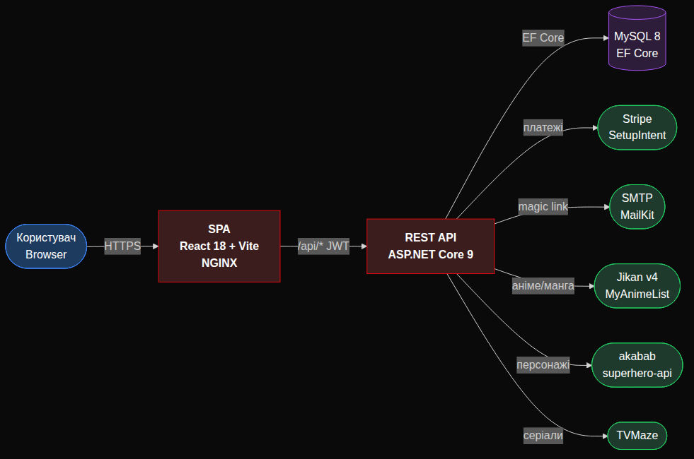
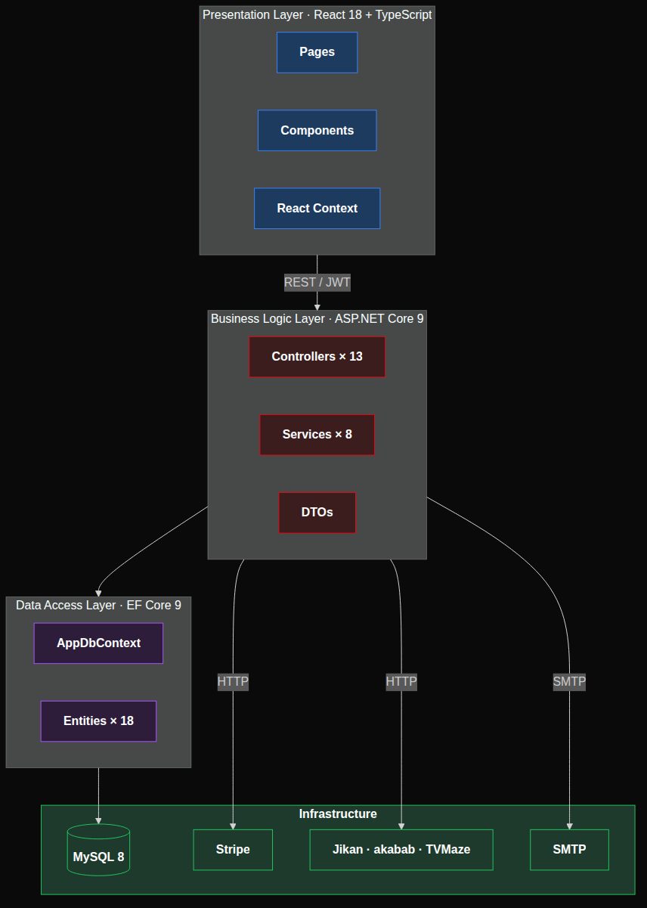

# Bazinga

## Інформаційна платформа розповсюдження мультимедійного контенту за моделлю підписки

Випускна кваліфікаційна робота бакалавра · 2025

---

# Розділ 1 · Спільна частина

## Загальний огляд проєкту

---

## 1.1. Тема, об'єкт і предмет дослідження

**Тема:** Інформаційна платформа розповсюдження мультимедійного контенту за моделлю підписки.

**Об'єкт дослідження:** процес розповсюдження ліцензованого мультимедійного контенту (відеоконтенту, коміксів, манги) за моделлю підписки.

**Предмет дослідження:** методи та програмні засоби побудови вебсервісу, що поєднує потоковий перегляд відео та онлайн-читання коміксів у межах одного облікового запису з підтримкою декількох профілів.

---

## 1.2. Актуальність

Сучасний споживач медіаконтенту вимушений тримати окремі підписки на кожну категорію:

- **Netflix** — серіали;
- **Crunchyroll** — аніме;
- **ComiXology Unlimited** — комікси;
- **Shonen Jump+** — манга.

Кожна з них вимагає окремої реєстрації, оплати, профіля та вибору контенту. Це призводить до фрагментації витрат, дублювання UX-операцій та збільшення сукупної вартості володіння.

---

## 1.3. Постановка проблеми

Відсутня готова інформаційна платформа, яка одночасно:

- поєднує потоковий відеоконтент і онлайн-читання коміксів/манги;
- працює за єдиною підпискою з кількома тарифами;
- підтримує мульти-профільну модель у межах одного облікового запису (Netflix-pattern);
- надає уніфікований інтерфейс і наскрізний пошук за усіма видами контенту;
- мінімізує тертя при реєстрації та оформленні платежу.

---

## 1.4. Мета і завдання роботи

**Мета:** спроектувати і реалізувати вебсервіс із підпискою, що об'єднує потоковий перегляд відео та читання коміксів і манги в межах одного облікового запису.

**Завдання:**

1. Спроектувати тришарову архітектуру системи.
2. Реалізувати безпарольну реєстрацію через магічне посилання.
3. Інтегрувати платіжний шлюз для оформлення підписки.
4. Реалізувати мульти-профільну модель (до 5 профілів на акаунт).
5. Інтегрувати агрегатор метаданих з відкритих джерел.
6. Реалізувати уніфікований каталог коміксів, манги, персонажів та серіалів.
7. Реалізувати наскрізний пошук одночасно по декількох джерелах.
8. Реалізувати потоковий перегляд відео у вбудованому HTML5-плеєрі.

---

## 1.5. Концепція рішення та системна архітектура

Класичний поділ **stateless REST бекенд + SPA фронтенд**, обидва контейнеризовано через Docker Compose. NGINX роздає скомпільовану збірку React, ASP.NET Core 9 експонує `/api/*` поверх MySQL через EF Core. Усі зовнішні інтеграції зосереджено на бекенді — це централізує кешування і керування rate-limit'ами.

---

## 1.6. Шари архітектури

- **Presentation** — сторінки React, компоненти, React Context.
- **Business Logic** — 13 контролерів + 8 інжектованих сервісів + DTO.
- **Data Access** — EF Core, `AppDbContext`, 18 ентіті, нормалізованих до 3НФ.
- **Infrastructure** — MySQL 8 + Jikan / akabab / TVMaze + Stripe + SMTP.

---

## 1.7. Стек технологій

| Шар | Технології |
|-----|------------|
| Backend | .NET 9, ASP.NET Core 9, EF Core 9, Pomelo.MySQL, MySQL 8, BCrypt.Net-Next, JWT Bearer, MailKit 4.8, Stripe.NET 47, `IMemoryCache`, Swashbuckle |
| Frontend | React 18, TypeScript 5.8, Vite 5, Tailwind CSS 3, shadcn/ui (Radix UI), React Router 6, TanStack Query 5, Stripe Elements |
| External APIs | Jikan v4 (MyAnimeList), akabab/superhero-api, TVMaze |
| Інфраструктура | Docker, Docker Compose, NGINX |

---

## 1.8. Загальні досягнуті результати

- Запущено повний прототип вебсервісу з REST API і SPA-клієнтом.
- Реалізовано **13 REST-контролерів** і **8 інжектованих сервісів**.
- Спроектовано БД на **18 ентіті**, нормалізовану до 3НФ.
- Інтегровано **3 безкоштовні no-auth джерела** метаданих + Stripe + SMTP.
- Розв'язано три критичні інженерні проблеми: race condition створення root-профіля, зависання UI при недоступності Stripe, rate-limit зовнішніх API.
- Розгортання — однією командою `docker compose up`.

---

# Розділ 2 · Розробник 1

## Підсистема облікових записів, профілів, підписок та оплати

---

## 2.1. Дослідження

Перед розробкою підсистеми проведено аналіз:

- сучасних патернів **безпарольної автентифікації** (passwordless / magic link) — на прикладі Netflix, Substack, Notion;
- стандарту **JWT** (RFC 7519) та алгоритмів підпису HMAC;
- алгоритмів адаптивного хешування паролів (**BCrypt**);
- вимог **PCI-DSS** до обробки даних платіжних карток;
- API платіжного шлюзу **Stripe** (Customer + SetupIntent);
- Netflix-патерну мульти-профільності («Who's watching?»);
- особливостей **React 18 StrictMode** (подвійні виклики ефектів у dev-режимі).

---

## 2.2. Актуальність і проблема підсистеми

Класична схема «логін + пароль одразу» має три практичних недоліки:

1. **Високе тертя** — користувачі покидають форми з понад 4 полями.
2. **Email не верифікується одразу** — є ризик помилок і фейкових акаунтів.
3. **Прийом картки на бекенді** → необхідність PCI-DSS сертифікації.

Окремо: вимога «питати профіль при кожному новому візиті, але не виходити з акаунта» суперечить простому збереженню стану в одному сховищі.

---

## 2.3. Мета і задачі підрозділу

**Мета:** забезпечити безпечний, відмовостійкий і мінімально тертя-обтяжений життєвий цикл облікового запису — від першого email до вибору профіля.

**Задачі:**

1. Реалізувати безпарольну реєстрацію через магічне посилання.
2. Забезпечити безпечне зберігання токенів реєстрації.
3. Реалізувати email-сервіс з підмінною реалізацією.
4. Реалізувати майстер реєстрації як кінцевий автомат.
5. Інтегрувати Stripe без зберігання даних карток на бекенді.
6. Забезпечити стійкість клієнта до недоступності Stripe.
7. Реалізувати мульти-профільну CRUD-підсистему.
8. Розділити збереження стану акаунта і поточного профіля.
9. Реалізувати маршрутні захисти на клієнті.
10. Розв'язати race condition створення root-профіля.
11. Забезпечити криптографічне зберігання паролів і сесій.

---

## 2.4. Методи і інструменти

**Серверні:** ASP.NET Core 9 + DI-контейнер; EF Core 9 + Pomelo.MySQL; MailKit 4.8 (SMTP); Stripe.NET 47; BCrypt.Net-Next; JWT Bearer.

**Клієнтські:** React 18 + TypeScript + React Context; Stripe Elements (`@stripe/react-stripe-js`); React Router 6.

**Архітектурні патерни:** Strategy (`IEmailSender`), Factory (`IHttpClientFactory`), Repository + Unit of Work (через `DbSet<T>` + `SaveChangesAsync`), Decorator (timeout / retry навколо HttpClient Stripe), DTO.

---

## 2.5. Результати за задачами

Наступні слайди презентують реалізацію та результат кожної задачі окремо.

---

## Задача 1 · Безпарольна реєстрація через magic link

**Завдання:** замінити класичну форму «логін + пароль на старті» безпарольною реєстрацією через одноразове посилання, надіслане на email.

**Реалізація:** 4 REST-ендпоінти у `Controllers/AuthController.cs`:

- `signup/check` (рядок 97) — миттєва перевірка зайнятості email;
- `signup/start` (110) — генерація токена + відправка листа (тіло на 139);
- `signup/verify` (148) — валідація токена (живий / використаний / прострочений);
- `signup/complete` (228) — створення акаунта і видача JWT.

**Отриманий результат:** перший крок реєстрації містить лише одне поле (email); email автоматично верифікований; повний цикл проходить без необхідності придумувати пароль на старті.

---

## Задача 2 · Безпечне зберігання токенів реєстрації

**Завдання:** усунути можливість експлуатації перехопленого магічного посилання — навіть при компрометації БД.

**Реалізація:**

- ентіті `Entities/SignupToken.cs` зберігає лише **SHA-256 хеш** посилання, оригінал не записується;
- хешування — `Security/SignupTokens.cs`;
- термін життя токена — **15 хвилин**;
- одноразове використання (поле `UsedAt`).

**Отриманий результат:** оригінальне посилання після генерації не зберігається ніде на сервері. Викрадення дампу БД не дає доступу до акаунтів; прострочений або вже використаний токен повертає 410 Gone.

---

## Задача 3 · Стратегічний інтерфейс email-сервісу

**Завдання:** забезпечити роботу системи у dev-середовищі без налаштованого SMTP, без зміни виробничого коду.

**Реалізація (Strategy):** інтерфейс `IEmailSender` з двома реалізаціями:

- `Services/SmtpEmailSender.cs:19` — виробничий, через MailKit;
- `Services/LoggingEmailSender.cs:19` — dev-fallback, друкує магічне посилання у журнал.

Вибір реалізації — у DI-контейнері залежно від конфігурації SMTP.

**Отриманий результат:** dev-середовище без пошти повністю відтворює flow реєстрації; перехід у продакшн зводиться до зміни реєстрації одного сервісу — без правок логіки.

---

## Задача 4 · Майстер реєстрації як кінцевий автомат

**Завдання:** реалізувати на клієнті багатокроковий процес довершення реєстрації з можливістю розгалуження.

**Реалізація:** сторінка `pages/SignUpComplete.tsx`:

- 4 стани FSM: `Welcome → Password → Plan → Card` (тип `Step`, рядок 36);
- два шляхи: безкоштовний Trial vs платний (тип `Path`, 37);
- розгалуження «Explore for Free» vs «Join Now» — рядки 171–180.

**Отриманий результат:** користувач має чіткий лінійний шлях з 4 кроків; перехід назад зберігає введені дані; стани автомата ізольовано від UI-логіки, що спрощує підтримку.

---

## Задача 5 · Інтеграція Stripe — Customer + SetupIntent

**Завдання:** прийняти платіжний інструмент користувача без зберігання даних картки на бекенді.

**Реалізація:**

- сервер — `Services/StripeBillingService.cs:35` створює `Customer` + `SetupIntent` через Stripe.NET;
- клієнт — компонент `components/StripeCardForm.tsx` з офіційним Stripe Elements; картка вводиться в iframe Stripe;
- ендпоінт-міст — `AuthController.cs:177` (`signup/billing-intent`) повертає `clientSecret`.

**Отриманий результат:** дані картки ніколи не торкаються нашого бекенду — PCI-DSS scope обмежено самим Stripe; платіжний метод прив'язується до Customer і доступний для майбутніх списань.

---

## Задача 6 · Відмовостійкість Stripe

**Завдання:** не допустити «зависання» клієнта при недоступності Stripe (за дефолтом таймаут HttpClient — 80 c).

**Реалізація:**

- HttpClient зі скороченим таймаутом **12 с** і одним retry — `StripeBillingService.cs:22`;
- маппінг помилок: `StripeException → 502`, таймаут → 504;
- клієнтський fallback на mock-форму — `SignUpComplete.tsx:835` (`!forceMock && billing.stripeConfigured ? Elements : mock`).

**Отриманий результат:** при недоступності Stripe клієнт за ≤ 24 c отримує чітку помилку або переходить на мок-форму; майстер реєстрації завершується в обох сценаріях, без сценарію «зависання».

---

## Задача 7 · Контролер профілів з обмеженнями домену

**Завдання:** забезпечити мульти-профільну модель з бізнес-обмеженнями (ліміт 5, захист root-профіля).

**Реалізація:** `Controllers/ProfilesController.cs`:

- константа `MaxProfilesPerUser = 5` (рядок 16) + перевірка ліміту (89);
- root-профіль не можна видалити (139);
- повний CRUD: GET (23), POST (80), PUT (111), DELETE (130).

**Отриманий результат:** один акаунт підтримує до 5 профілів (Netflix-pattern); root-профіль гарантовано існує і захищений від видалення; бізнес-правила централізовано в одному контролері.

---

## Задача 8 · Розділення збереження стану клієнта

**Завдання:** виконати вимогу «питати профіль при кожному новому візиті», але не виходити з акаунта між сесіями.

**Реалізація:** `contexts/AuthContext.tsx`:

- дані акаунта і JWT → `localStorage` (рядки 76, 94) — живуть між сесіями;
- активний профіль → `sessionStorage` (83, 99) — очищується при закритті браузера.

**Отриманий результат:** користувач залишається залогіненим між сесіями, але при кожному новому візиті бачить екран «Who's watching?». Це точне виконання бізнес-вимоги і повторення UX Netflix.

---

## Задача 9 · Маршрутні захисти на клієнті

**Завдання:** не допускати доступу до захищених сторінок без автентифікації та активного профіля.

**Реалізація:** `App.tsx`:

- `RequireAuth` (рядок 66) — перевіряє наявність JWT;
- `RequireProfile` (72) — перевіряє наявність активного профіля у `sessionStorage`;
- `RootGate` (55) — маршрутизує між Landing / Profile selector / Choice.

**Отриманий результат:** будь-яка спроба зайти за прямим URL на захищений маршрут без JWT або без активного профіля — редирект на відповідний крок flow без витоку контенту.

---

## Задача 10 · Розв'язання race condition створення root-профіля

**Завдання:** усунути дублювання root-профіля під React 18 StrictMode (двічі викликаний `GET /api/profiles` → два «Main»).

**Реалізація — трирівневий захист:**

1. атомарне створення root-профіля у `AuthController.cs:280` (`EnsureRootProfile`) — прямо при реєстрації;
2. fallback для існуючих акаунтів — `ProfilesController.cs:64` з `try/catch DbUpdateException` + дедуплікація;
3. прибрано зайвий повторний fetch на клієнті у `ProfileSelector`.

**Отриманий результат:** дублювання root-профіля не відтворюється навіть під StrictMode; для уже-постраждалих акаунтів спрацьовує клієнтська дедуплікація — без міграцій БД.

---

## Задача 11 · Криптографічне зберігання паролів і сесій

**Завдання:** мінімізувати ризик компрометації акаунтів при витоку БД.

**Реалізація:**

- паролі — `Security/BCryptPasswordHasher.cs` з адаптивним work-factor;
- сесії — `Services/JwtService.cs:20`, JWT з підписом HMAC SHA-256;
- magic-токени — SHA-256 хеш, одноразові, 15 хв TTL.

**Отриманий результат:** при витоку дампу БД оригінальні паролі обчислювально не відновлюються; JWT не підробляються без знання серверного секрету; magic-посилання не використовується повторно.

---

## 2.6. Висновки розділу

Наступні висновки прив'язано до конкретних задач, презентованих вище.

---

## Висновок 1 · Безпарольна реєстрація

**Що зроблено:** реалізовано passwordless-реєстрацію через 4-ендпоінтний flow з магічним посиланням (Задача 1).

**Що перевірено:** повний цикл «email → лист → токен → пароль → план → автовхід» працює у dev-середовищі (через `LoggingEmailSender`) і в бойовому (через SMTP).

**Який результат:** реєстрація з одним полем на старті, email автоматично верифікований. Архітектурно — сучасний Netflix-pattern 2024+.

---

## Висновок 2 · Безпека токенів і паролів

**Що зроблено:** SHA-256 хешування magic-токенів (Задача 2); BCrypt-хешування паролів і HMAC-підпис JWT (Задача 11).

**Що перевірено:** оригінальне магічне посилання після генерації не зберігається у БД; токен дійсний 15 хв і одноразовий; JWT не валідується без серверного секрету.

**Який результат:** компрометація дампу БД не дає доступу ні до акаунтів, ні до активних сесій.

---

## Висновок 3 · Відмовостійка інтеграція Stripe

**Що зроблено:** інтеграція через SetupIntent без зберігання даних карток на бекенді (Задача 5); таймаут 12 c + retry + mock-fallback (Задача 6).

**Що перевірено:** при штучному блокуванні Stripe-домену клієнт завершує flow через мок-форму за ≤ 24 c; при робочому Stripe — повний цикл прив'язки картки до Customer.

**Який результат:** PCI-DSS scope обмежено самим Stripe; немає сценарію, у якому майстер реєстрації «зависає» на нескінченному завантаженні.

---

## Висновок 4 · Мульти-профільна модель

**Що зроблено:** CRUD-підсистема профілів з лімітом 5 і захистом root (Задача 7); розділення стану `localStorage` + `sessionStorage` (Задача 8); маршрутні захисти (Задача 9).

**Що перевірено:** після перезапуску браузера користувач автоматично потрапляє на екран «Who's watching?», але не виходить з акаунта; root-профіль не видаляється; шостий профіль не створюється.

**Який результат:** точна реалізація бізнес-вимоги «питати профіль щовізиту» і Netflix-патерну мульти-профільності.

---

## Висновок 5 · Стійкість до race condition

**Що зроблено:** трирівневий захист від дублювання root-профіля під React StrictMode (Задача 10).

**Що перевірено:** ні нові, ні існуючі акаунти не отримують двох «Main», навіть під StrictMode у dev-режимі.

**Який результат:** атомарна гарантія створення рівно одного root-профіля при реєстрації; клієнтська дедуплікація як safety net для існуючих акаунтів.

---

# Розділ 3 · Розробник 2

## Підсистема каталогу контенту, агрегатора метаданих та потокового відео

---

## 3.1. Дослідження

Перед розробкою підсистеми проведено аналіз:

- ринку **галузевих metadata-API**: Marvel API, ComicVine, TMDB — усі вимагають реєстрації, ключа і/або підпису кожного запиту;
- безкоштовних no-auth джерел: **Jikan v4** (MyAnimeList), **akabab/superhero-api**, **TVMaze**;
- патерну **Cache-Aside** для зменшення кількості зовнішніх запитів і обходу rate-limit'ів;
- UX-патернів Netflix: горизонтальні рейли, hero-карусель, наскрізний пошук Cmd/Ctrl+K;
- стандарту **HTML5 `<video>`** для потокового перегляду без зовнішнього плеєра.

---

## 3.2. Актуальність і проблема підсистеми

Власної редакційної бази на тисячі тайтлів немає; ручне наповнення прототипу нереалістичне. Більшість галузевих API:

- **платні** (TMDB Pro, ComiXology API);
- вимагають **MD5-підпис кожного запиту** (Marvel API);
- не повертають **обкладинки** (Marvel Metadata API);
- мають жорсткі **rate-limit'и** (Jikan — 3 req/s).

Окрема UI-проблема — комікси і манга мають різну структуру даних, але повинні візуально виглядати однаково у каталозі.

---

## 3.3. Мета і задачі підрозділу

**Мета:** забезпечити повний контент-шар платформи (каталог коміксів, манги, персонажів, серіалів, потокового відео), використовуючи відкриті безкоштовні джерела метаданих з відмовостійкістю та кешуванням.

**Задачі:**

1. Спроектувати агрегатор метаданих як єдину точку входу для клієнта.
2. Інтегрувати Jikan v4 для аніме та манги.
3. Інтегрувати akabab/superhero-api для персонажів коміксів.
4. Інтегрувати TVMaze для супергеройських серіалів.
5. Реалізувати NSFW-фільтрацію манги.
6. Реалізувати Cache-Aside через `IMemoryCache`.
7. Уникнути дублювання коду через generic-метод пагінації.
8. Оптимізувати роботу з великим датасетом akabab.
9. Спроектувати уніфікований компонент картки контенту.
10. Реалізувати Netflix-стиль горизонтального рейла.
11. Реалізувати наскрізний пошук по трьох джерелах.
12. Реалізувати hero-карусель BazingaTV.
13. Реалізувати повноекранний HTML5-плеєр.
14. Виправити рендеринг локальних обкладинок.

---

## 3.4. Методи і інструменти

**Серверні:** ASP.NET Core 9 + `IHttpClientFactory`; `IMemoryCache` (Cache-Aside); generic-методи C# для усунення дублювання; `System.Text.Json`.

**Клієнтські:** React 18 + TypeScript; TanStack Query 5; shadcn/ui + Tailwind CSS 3; Radix UI Dialog; embla-carousel-react; нативний HTML5 `<video>`.

**Архітектурні патерни:** Cache-Aside, Dependency Inversion (через `IJikanService`, `ISuperheroService`), DTO, Generic-метод як форма повторного використання.

---

## 3.5. Результати за задачами

Наступні слайди презентують реалізацію та результат кожної задачі окремо.

---

## Задача 1 · Архітектура агрегатора метаданих

**Завдання:** надати клієнту єдину точку входу для всіх типів метаданих, незалежно від базового джерела.

**Реалізація:** `Controllers/MetadataController.cs` — 16 ендпоінтів:

- аніме: `top` (рядок 24), `search` (45), `genres` (64);
- манга: `top` (69), `search` (76);
- персонажі: `superheroes` (99), `publishers` (109);
- серіали: `superhero-shows` (122), `search` (126).

Два сервіси за інтерфейсами (Dependency Inversion): `IJikanService`, `ISuperheroService`.

**Отриманий результат:** клієнт не знає про існування Jikan / akabab / TVMaze — він бачить uniform-DTO. Заміна джерела не вимагає змін у клієнті.

---

## Задача 2 · Інтеграція Jikan v4

**Завдання:** покрити каталог аніме і манги безкоштовними даними з обкладинками, описами та рейтингами.

**Реалізація:** `Services/JikanService.cs`:

- топ і пошук аніме (методи `GetTopAnime`, `SearchAnime`);
- топ і пошук манги (`GetTopManga`, `SearchManga`);
- агрегований список жанрів і тем (об'єднання двох списків Jikan).

**Отриманий результат:** ряди «TOP ANIME» і «TOP MANGA» на головній заповнено реальними даними MyAnimeList — обкладинки, рейтинги, описи. Сторінка `/manga` працює з повноцінною пагінацією.

---

## Задача 3 · Інтеграція akabab/superhero-api

**Завдання:** покрити каталог персонажів коміксів (Marvel, DC, Dark Horse тощо).

**Реалізація:** `Services/SuperheroService.cs`:

- статичний JSON-датасет (~1 МБ, ~731 запис) тягнеться **одним fetch** (метод `LoadAllAsync`, рядок 118);
- ендпоінти `superheroes` і `publishers` працюють поверх цього датасету;
- фільтрація по видавцях відбувається у пам'яті (рядки 58–108).

**Отриманий результат:** сторінка `/characters` показує реальних персонажів з обкладинками і біографіями; фільтрація по видавцях (Marvel / DC / Image) працює миттєво.

---

## Задача 4 · Інтеграція TVMaze

**Завдання:** покрити блок «Superhero Shows» на BazingaTV реальними серіалами з постерами і анотаціями.

**Реалізація:** у `SuperheroService.cs`:

- куратований набір з **27** цільових запитів до TVMaze;
- об'єднання + дедуплікація результатів;
- кеш **6 годин** (рядок 26, метод на 174).

**Отриманий результат:** ряд «Superhero Shows» наповнено сетом серіалів (Daredevil, The Boys, Watchmen тощо) з постерами і короткими описами; rate-limit TVMaze не порушується.

---

## Задача 5 · NSFW-фільтрація манги

**Завдання:** не допустити появи дорослих жанрів манги на головній і у пошуку.

**Реалізація:** у `JikanService.cs:77` — константа `MangaExcludedGenres = "9,12,28,30,49"` (Ecchi, Hentai, Boys Love, Girls Love, Erotica); застосовується через параметр `genres_exclude` Jikan-API (рядок 100).

**Отриманий результат:** топ-манга і пошук манги не повертають дорослого контенту; параметр `sfw=true` Jikan виявився недостатнім — додаткова явна фільтрація закриває залишкові випадки.

---

## Задача 6 · Cache-Aside через IMemoryCache

**Завдання:** уникнути перевищення rate-limit'у Jikan (3 req/s) і зменшити навантаження на TVMaze.

**Реалізація (Cache-Aside):**

- `IMemoryCache` як основне сховище;
- TTL списків — **15 хв** (`JikanService.cs:10`);
- TTL деталей — кеш на рядках 58, 107;
- TTL akabab датасету — **12 год** (рядок 20);
- TTL списків TVMaze — **6 год**.

**Отриманий результат:** повторні переходи каталогом не йдуть у мережу; rate-limit Jikan не вичерпується навіть під час інтенсивної демонстрації; час відповіді кешованого запиту — мілісекунди.

---

## Задача 7 · Generic-метод GetPagedCached

**Завдання:** усунути дублювання у ~10 майже однакових методах кешованої пагінації для Jikan-DTO.

**Реалізація:** `JikanService.GetPagedCached<TRaw, TDto>` — generic-метод з двома параметрами типу: сире DTO провайдера і власне DTO платформи. Використовується у методах на рядках 29–53.

**Отриманий результат:** замість 10 копій-вставок з різними типами — один типобезпечний метод; усі майбутні зміни логіки кешування виконуються в одному місці. Помилку CS0411 при виклику виправлено явним заданням типових аргументів.

---

## Задача 8 · Bulk-стратегія для akabab

**Завдання:** мінімізувати кількість зовнішніх запитів для каталогу персонажів (~731 запис).

**Реалізація:** `Services/SuperheroService.cs`:

- весь датасет тягнеться **одним запитом** (~1 МБ JSON) — рядок 118;
- кешується на **12 годин** (рядок 20);
- пошук, фільтрація і пагінація працюють **у пам'яті** — рядки 58–108.

**Отриманий результат:** перемикання фільтра видавців (Marvel → DC → Image) відбувається миттєво — без жодного мережевого запиту; залежність від доступності джерела знімається на 12 годин.

---

## Задача 9 · Уніфікований компонент MediaCard

**Завдання:** забезпечити ідентичний візуальний стиль карток для коміксів і манги без дублювання компонентів.

**Реалізація:** `components/MediaCard.tsx`:

- універсальна картка з пресетами ширини (рядок 21);
- градієнтний fallback з назвою при відсутності обкладинки (рядок 46);
- однаковий API для коміксів і манги.

**Отриманий результат:** комікси і манга у каталозі виглядають однаково; зламана обкладинка не «псує сітку» — замінюється градієнтом з назвою; нові типи контенту інтегруються без створення нових компонентів картки.

---

## Задача 10 · Netflix-стиль горизонтального рейла

**Завдання:** реалізувати горизонтальні ряди з кнопками-стрілками і прихованим скролбаром, як у Netflix.

**Реалізація:** `components/Rail.tsx`:

- стрілки-кнопки ліво/право, що з'являються на hover;
- утиліта `no-scrollbar` для нативного приховування скролбара (рядок 79);
- generic-ряд `components/ComicSection.tsx` зберігає тип контенту в `onClick` — один ряд може містити одночасно комікс і мангу.

**Отриманий результат:** ряд NEW THIS WEEK на головній відображає змішаний контент (комікс + манга), клік відкриває правильну модалку залежно від типу.

---

## Задача 11 · Наскрізний пошук по 3 джерелах

**Завдання:** дозволити пошук одночасно за коміксами, мангою і персонажами з одного поля, з відкриттям результатів in-place.

**Реалізація:** `components/MasterSearch.tsx`:

- три джерела одночасно: локальні комікси + персонажі + манга (рядки 35–37, 68);
- дебаунс 250 мс;
- клік відкриває одну з трьох модалок (`ComicModal`, `MangaModal`, `HeroModal`) прямо у накладенні — без переходу (рядки 52–54);
- активація через **Cmd/Ctrl+K**.

**Отриманий результат:** користувач знаходить контент будь-якого типу з одного поля; перехід на детальну сторінку не потрібен — модалка відкривається поверх поточного контексту.

---

## Задача 12 · BazingaTV hero — випадкові фрагменти трейлерів

**Завдання:** забезпечити динамічну hero-секцію з трейлерами серіалів, що не повторюються однаково між відвідуваннями.

**Реалізація:** `components/TVHero.tsx`:

- випадковий вибір фрагмента **10–15 с** з трейлера (рядки 12–13);
- автоматичний перехід на наступний трейлер після завершення фрагмента (рядки 32–38);
- HTML5 `<video>` без зовнішнього плеєра.

**Отриманий результат:** hero-секція BazingaTV при кожному відвідуванні показує інший фрагмент іншого трейлера; візуально близько до Netflix-домашньої.

---

## Задача 13 · Повноекранний HTML5-плеєр

**Завдання:** реалізувати повноекранний перегляд відео без сторонніх плеєрів.

**Реалізація:** `pages/Watch.tsx`:

- маршрут `/bazinga-tv/watch/:slug`;
- HTML5 `<video>` з нативними контролами;
- автозапуск + закриття по Escape.

**Отриманий результат:** перехід з картки шоу → одразу повноекранний перегляд; немає залежності від сторонніх SDK; розмір клієнтського бандла не зростає за рахунок зовнішнього плеєра.

---

## Задача 14 · Виправлення рендерингу локальних обкладинок

**Завдання:** усунути 404 для Vite-bundled обкладинок коміксів і красиво деградувати при будь-яких збоях завантаження зовнішніх зображень.

**Реалізація:**

- `lib/images.ts`: функція `resolveImageUrl` пропускає Vite-шляхи (`/assets/...`) без додавання `API_URL`;
- `MediaCard.tsx:46`: градієнтний fallback з назвою при `onError`.

**Отриманий результат:** локальні обкладинки рендеряться без 404; зовнішні обкладинки з мережевою помилкою замінюються градієнтом — сітка карток ніколи не «ламається».

---

## 3.6. Висновки розділу

Наступні висновки прив'язано до конкретних задач, презентованих вище.

---

## Висновок 1 · Агрегатор з 3 безкоштовних API

**Що зроблено:** спроектовано і реалізовано `MetadataController` з 16 ендпоінтами поверх інтерфейсів `IJikanService` і `ISuperheroService` (Задачі 1–4).

**Що перевірено:** усі 16 ендпоінтів повертають uniform-DTO незалежно від джерела; клієнт не залежить від конкретних провайдерів.

**Який результат:** контент-шар повністю покрито безкоштовними no-auth джерелами; майбутній перехід на ліцензовану БД не зачіпає клієнт — потрібна лише заміна реалізації двох інтерфейсів.

---

## Висновок 2 · Кешування через Cache-Aside

**Що зроблено:** реалізовано Cache-Aside через `IMemoryCache` з диференційованими TTL — 15 хв / 6 год / 12 год (Задача 6); generic-метод `GetPagedCached` усуває дублювання (Задача 7).

**Що перевірено:** повторні переходи каталогом не призводять до зовнішніх запитів; rate-limit Jikan (3 req/s) не вичерпується навіть під час інтенсивної демонстрації.

**Який результат:** час відповіді кешованих запитів — мілісекунди; залежність від rate-limit'ів зовнішніх джерел знято для пошуку і пагінації.

---

## Висновок 3 · Bulk-стратегія для akabab

**Що зроблено:** весь датасет akabab (~1 МБ, 731 запис) тягнеться одним fetch і кешується на 12 год; пошук, фільтрація і пагінація — у пам'яті (Задача 8).

**Що перевірено:** перемикання фільтра видавців на `/characters` відбувається миттєво, без жодного мережевого запиту.

**Який результат:** ціна 1 МБ трафіку раз на 12 годин дешевша за десятки посторінкових запитів; робота сторінки не залежить від поточної доступності датасету.

---

## Висновок 4 · Уніфікований UI і компонентна композиція

**Що зроблено:** один компонент `MediaCard` для всіх типів контенту (Задача 9); generic-рейл `ComicSection` зі змішаним контентом (Задача 10); fallback на градієнт замість зламаної обкладинки (Задача 14).

**Що перевірено:** картки коміксів і манги візуально ідентичні; ряд NEW THIS WEEK містить мікс типів і правильно маршрутизує клік; зламана обкладинка не «псує» сітку.

**Який результат:** при додаванні нового типу контенту компонент картки не дублюється; UI масштабується без візуальної фрагментації.

---

## Висновок 5 · Наскрізний пошук і потокове відео

**Що зроблено:** `MasterSearch` шукає одночасно по 3 джерелах з in-place модалками (Задача 11); `TVHero` + `Watch.tsx` забезпечують hero-карусель з трейлерами і повноекранний HTML5-плеєр (Задачі 12, 13).

**Що перевірено:** пошук «Berserk» (Cmd/Ctrl+K) повертає результати у трьох категоріях; перегляд серіалу відкривається у повноекранному плеєрі без сторонніх SDK.

**Який результат:** контент-користувацький шлях «знайти → відкрити → переглянути» закрито повністю у межах SPA.

---

# Розділ 4

## Розподіл роботи між розробниками

---

## 4.1. Розробник 1 — підсистема акаунтів, профілів та оплати

**Реалізовані модулі (сервер):**

- `Controllers/AuthController.cs` — 5 ендпоінтів signup-flow + сесія;
- `Controllers/ProfilesController.cs` — CRUD профілів з обмеженнями;
- `Services/StripeBillingService.cs` — інтеграція Stripe з timeout/retry;
- `Services/JwtService.cs` — JWT з HMAC SHA-256;
- `Security/BCryptPasswordHasher.cs`, `Security/SignupTokens.cs`;
- `Services/SmtpEmailSender.cs` + `Services/LoggingEmailSender.cs` (Strategy через `IEmailSender`);
- ентіті `User`, `Profile`, `SignupToken` у БД.

**Реалізовані модулі (клієнт):**

- `pages/SignUpComplete.tsx` — 4-крокова FSM-реєстрація;
- `components/StripeCardForm.tsx`;
- `contexts/AuthContext.tsx` — стан акаунта (`localStorage`) + поточний профіль (`sessionStorage`);
- `App.tsx` — `RootGate`, `RequireAuth`, `RequireProfile`;
- `pages/ProfileSelector.tsx`, `pages/ManageProfiles.tsx`, `pages/ProfileEditor.tsx`, `pages/Profile.tsx`.

**Архітектурні рішення:** Strategy для email; Decorator (timeout + retry) навколо Stripe HttpClient; розділення `localStorage` / `sessionStorage`; трирівневий захист від race condition; route guards як HOC.

**Технології:** ASP.NET Core 9, EF Core 9, MailKit, Stripe.NET, BCrypt.Net-Next, JWT Bearer, React Context, Stripe Elements.

---

## 4.2. Розробник 2 — підсистема контенту та потокового відео

**Реалізовані модулі (сервер):**

- `Controllers/MetadataController.cs` — 16 ендпоінтів метаданих;
- `Services/JikanService.cs` — інтеграція Jikan v4 з кешем і NSFW-фільтром;
- `Services/SuperheroService.cs` — akabab + TVMaze з bulk-стратегією та куратованим сетом;
- `Services/PricingService.cs` — динамічні ціни залежно від тарифу підписки.

**Реалізовані модулі (клієнт):**

- `pages/Comics.tsx`, `pages/AllComics.tsx`, `pages/Manga.tsx`, `pages/Characters.tsx`;
- `pages/BazingaTV.tsx`, `pages/Watch.tsx`;
- `components/MediaCard.tsx`, `components/Rail.tsx`, `components/ComicSection.tsx`;
- `components/MasterSearch.tsx`, `components/ComicModal.tsx`, `components/MangaModal.tsx`, `components/HeroModal.tsx`;
- `components/TVHero.tsx`;
- `lib/images.ts` — включно з виправленням Vite-шляхів і градієнтним fallback.

**Архітектурні рішення:** Cache-Aside через `IMemoryCache` з диференційованими TTL; generic `GetPagedCached<TRaw, TDto>`; bulk-стратегія для akabab (in-memory operations); уніфікований `MediaCard` для будь-якого типу контенту; in-place модалки замість переходу на нову сторінку.

**Технології:** ASP.NET Core 9, `IHttpClientFactory`, `IMemoryCache`, generic C#, Jikan v4, akabab/superhero-api, TVMaze, React 18, TanStack Query, Radix UI Dialog, нативний HTML5 video.

---

## Дякую за увагу

Готові відповісти на питання комісії.
