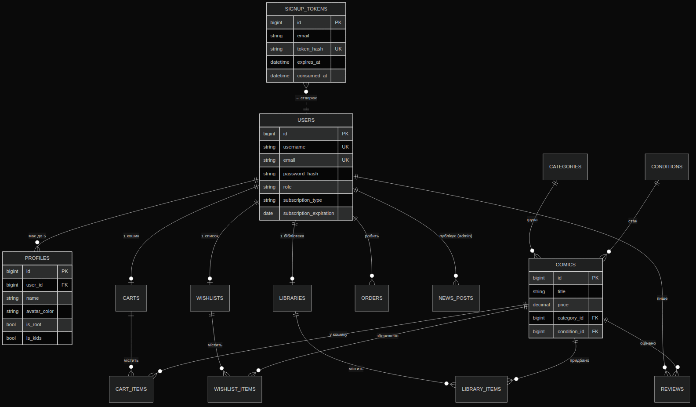
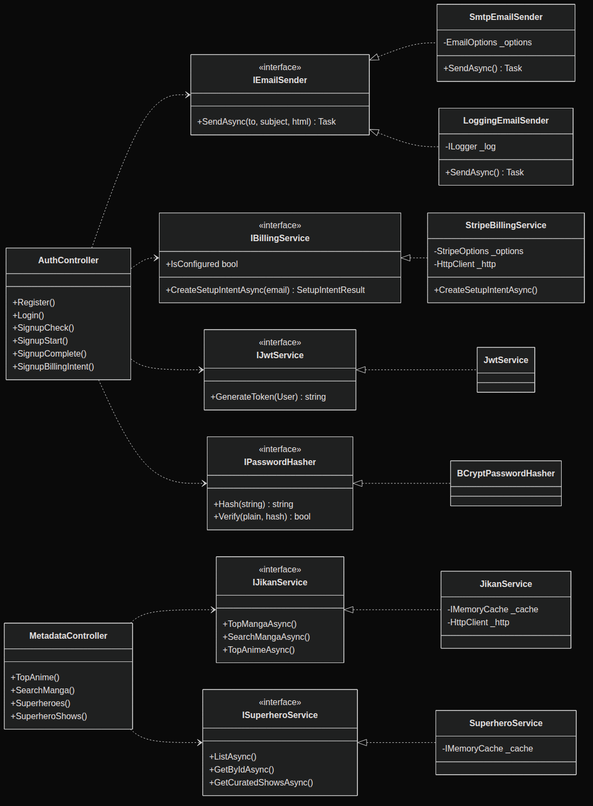

# Bazinga

## Інформаційна платформа розповсюдження мультимедійного контенту за моделлю підписки

Випускна кваліфікаційна робота бакалавра · 2025

---

## 1. Вступ

**Bazinga** — це вебсервіс із підпискою, який поєднує два світи на одному обліковому записі:

- **Bazinga Comics** — каталог коміксів, манги та персонажів. Читання випусків онлайн, без завантаження файлів локально.
- **BazingaTV** — потоковий перегляд відеоконтенту: мультсеріалів, аніме, ігрового відео; супергеройських серіалів.

Сервіс будувався як **клон Netflix** з паралельним каталогом коміксів. Користувач реєструється через електронну пошту (passwordless, magic link), обирає тарифний план, додає платіжний інструмент через Stripe, далі обирає один із п'яти профілів облікового запису ("Who's watching?") і отримує доступ до всього контенту.

Технологічно — SPA на React 18 + TypeScript над REST API на ASP.NET Core 9 + MySQL, з кешуючим агрегатором метаданих з відкритих джерел (Jikan / akabab / TVMaze).

---

## 2. Проблема

Сучасний споживач медіаконтенту тримає у себе **по одній підписці на кожну категорію контенту**: Netflix для серіалів, Crunchyroll для аніме, ComiXology Unlimited для коміксів, Shonen Jump+ для манги. Кожна вимагає окремої реєстрації, окремої оплати, окремого профілю, окремого «who's watching».

**Bazinga вирішує цю фрагментацію:**

- одна реєстрація для серіалів, аніме, коміксів і манги;
- один обліковий запис з підтримкою до **5 профілів** (Netflix-pattern: Main + Kids + сімейні);
- одна підписка з трьома тарифами + 7-денний Trial замість трьох-чотирьох окремих оплат;
- універсальний пошук одночасно за коміксами, мангою і персонажами;
- адаптивний інтерфейс під десктоп / планшет / телефон.

Цільова аудиторія — глядач і читач, який вже звик до Netflix-UX, але вимушений жонглювати кількома сервісами для повного покриття інтересів. Bazinga забирає трутість з підбору контенту і повертає на перший план сам контент.

---

## 3. Архітектура

### 3.1. Системна архітектура (контейнерна діаграма)

Класичний **stateless REST бекенд + SPA фронтенд**. Обидва контейнеризовано через Docker Compose; NGINX роздає скомпільовану збірку React, ASP.NET Core 9 експонує `/api/*` поверх MySQL через EF Core. Усі вихідні інтеграції зосереджено у бекенді — це дозволяє кешувати їх у пам'яті та керувати rate-limit'ами в одному місці.

---

## 3. Архітектура · Шари

### 3.2. Тришарова архітектура (3-layer / N-tier)

- **Presentation** — сторінки, компоненти, React Context. **Business** — 13 контролерів + 8 сервісів. **Data Access** — EF Core, `AppDbContext`, 18 ентіті. **Infrastructure** — MySQL + Jikan/akabab/TVMaze + Stripe + SMTP.
- Поділ дає тестованість логіки незалежно від БД і можливість підміни сервісів (`IBillingService` → mock) без зміни контролерів.

---

## 3. Архітектура · База даних

### 3.3. Схема бази даних (ER-діаграма)

`USERS` — центральна сутність. Профілі / кошик / wishlist / library / замовлення / відгуки прив'язані каскадом (`OnDelete: Cascade`). Магічні токени реєстрації (`SIGNUP_TOKENS`) зберігаються виключно як **SHA-256 хеш** — оригінальне значення посилання після генерації не зберігається. Паролі — BCrypt-хеш з адаптивним фактором роботи.

База нормалізована до **3НФ**. Усі таблиці створюються через `EnsureCreated()` + ідемпотентний `CREATE TABLE IF NOT EXISTS` (для оновлення схеми існуючих БД без міграцій).

---

## 3. Архітектура · Класи

### 3.4. Класова діаграма ключових сервісів

Кожен сервіс реалізує **інтерфейс** — це дозволяє підміняти реалізацію без зміни контролерів, що використовують її. Так, `IEmailSender` має дві реалізації: `SmtpEmailSender` (виробничий) і `LoggingEmailSender` (dev-fallback, який друкує магічне посилання у журнал).

---

## 3. Архітектура · Патерни і принципи

### 3.5. SOLID, DI, патерни

**SOLID:**

- **S** — кожен контролер ⇄ одна ресурсна область (`Auth`, `Profiles`, `Comics`, `Metadata`, …).
- **O** — додавання нового метаджерела не змінює існуючих контролерів (новий сервіс + DI).
- **L** — `SmtpEmailSender` ⇄ `LoggingEmailSender` через `IEmailSender`.
- **I** — вузькі інтерфейси (`IPasswordHasher`, `IJwtService`, `IBillingService`).
- **D** — контролери залежать від інтерфейсів, конкретні реалізації — через DI ASP.NET Core.

**Патерни:** Repository + Unit of Work (через `DbSet<T>` + `SaveChangesAsync`); Factory (`IHttpClientFactory`); Strategy (`IBillingService` / `IEmailSender` з fallback-режимами); DTO (відокремлено від ентіті); Decorator (HttpClient з таймаутом і retry навколо Stripe); Cache-Aside (`IMemoryCache` навколо Jikan/akabab/TVMaze).

**Стиль архітектури** — близько до Clean Architecture з тришаровою організацією. CQRS свідомо не запроваджували — обсяг операцій запису помірний.

---

## 5. Проблеми при розробці

### Відкриті API-провайдери метаданих
**Проблема:** галузеві API (Marvel, ComicVine, TMDB) вимагають реєстрації, ключа, hash-підписування. Marvel Metadata API — без обкладинок.
**Рішення:** обрано три повністю **безкоштовні no-auth** провайдери — **Jikan v4** (аніме + манга), **akabab/superhero-api** (персонажі), **TVMaze** (серіали).

### Race condition при створенні root-профілю
**Проблема:** React StrictMode викликає `GET /api/profiles` двічі; обидва виклики створюють root-профіль → у користувача з'являються два «Main».
**Рішення (Factory + Idempotency):** root-профіль створюється атомарно в `AuthController.SignupComplete`. `ProfilesController.List` має fallback з `try/catch DbUpdateException` і дедуплікацією.

### Stripe може бути недоступний
**Проблема:** клієнтський wizard зависав на 80 с за дефолтним таймаутом.
**Рішення (Circuit-Breaker + Strategy):** `HttpClient` з таймаутом 12 с і одним retry. Маппінг помилок: `StripeException → 502`, таймаут → 504. Mock-форма fallback (`forceMock`) — демо завершується навіть без Stripe.

### Кешування зовнішніх запитів
**Проблема:** Jikan rate-limit 3 req/s; akabab — 1 МБ JSON; TVMaze повільний.
**Рішення (Cache-Aside):** `IMemoryCache` — від 5 хв (live-пошук) до 24 год (жанри). Dataset akabab кешується 12 год — пошук і фільтрація йдуть по пам'яті.

### Vite-bundled assets через API URL
**Проблема:** `resolveImageUrl` додавав `API_URL` до `/assets/comic-X-<hash>.jpg` → 404.
**Рішення:** функція пропускає Vite-шляхи без модифікації; `MediaCard` має градієнтний fallback з назвою — зламана картка виглядає інтенційно.

---

## 6. Використані інструменти та технології

### Backend
- **.NET 9** · ASP.NET Core 9
- **Entity Framework Core 9**
- **Pomelo.EFCore.MySql 9**
- **MySQL 8**
- **BCrypt.Net-Next**
- **JWT Bearer** (RFC 7519)
- **MailKit 4.8** (SMTP)
- **Stripe.NET 47**
- **IMemoryCache**
- **Swashbuckle / Swagger**

### Frontend
- **React 18** + **TypeScript 5.8**
- **Vite 5**
- **Tailwind CSS 3**
- **shadcn/ui** + **Radix UI**
- **TanStack Query 5**
- **React Router 6**
- **next-themes** (dark)
- **@stripe/react-stripe-js**
- **lucide-react** (icons)
- **embla-carousel-react**
- **react-hook-form** + **zod**
- **sonner** (toasts)

### External APIs (no-auth)
- **Jikan v4** — аніме / манга
- **akabab/superhero-api**
- **TVMaze** — серіали

### DevOps / Інфраструктура
- **Docker** + Docker Compose
- **NGINX**
- **Git** / GitHub PR workflow
- **ESLint** + **Prettier**

### Документація
- **Mermaid CLI** (діаграми)
- **WeasyPrint** (PDF)
- **Figma** (макети)

---

## 7. Демонстрація продукту

Ключові flow для демонстрації:

1. **Реєстрація через magic link** — Landing → перевірка e-mail → лист з токеном → пароль → план → картка Stripe → автовхід.
2. **Profile selector** — «Who's watching?» з аватарами і прапорцем Kids.
3. **Choice page** — вибір між Read (Bazinga Comics) і Watch (BazingaTV).
4. **Bazinga Comics home** — hero-карусель, фільтри Browse by (Series / Creator), горизонтальні рейли COMICS і MANGA з арку-кнопками, NEW THIS WEEK зі змішаним контентом.
5. **Master search** (Cmd/Ctrl+K) — пошук одночасно за коміксами, персонажами і мангою; клік на результат відкриває детальне модальне вікно прямо у накладенні.
6. **Catalog pages** — `/comics/all`, `/manga`, `/characters` з пагінацією і фільтрами видавців.
7. **BazingaTV** — hero-карусель трейлерів з випадковими 10–15-секундними фрагментами і шість тематичних рядів аніме + супергеройські серіали.
8. **Watch page** — повноекранний HTML5-плеєр.
9. **Account page** — Netflix-style sidebar з підрозділами Overview, Subscription, Security, Devices, Profiles.

---

## 8. Плани на майбутнє

### Найближче
- **Continue Watching** із реальним прогресом
- **TOTP 2FA** (доповнення до magic-link)
- **PIN-захист профілів** (особл. Kids)

### Каталог + Платежі
- Інтеграція з **TMDB** для серіалів і фільмів
- **MangaDex API** як другим джерелом манги
- Власні **Bazinga Originals**
- Реальні **Stripe Subscriptions**
- **Річні тарифи** зі знижкою
- **Family Plan** з окремою ставкою

### Інфраструктура
- **HLS / DASH** для адаптивного відео
- **CDN** для статики (Cloudflare)
- **Service Worker** — офлайн-читання
- **Рекомендаційна система** (collaborative filtering)

